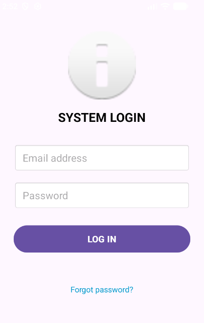
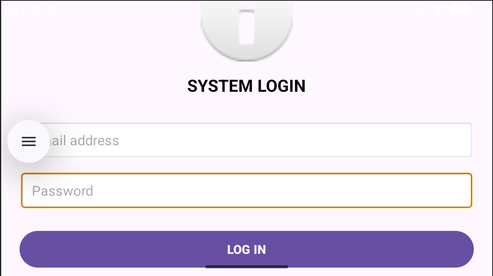
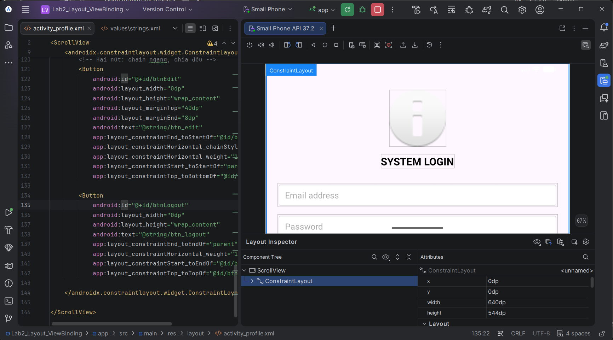

# Lab 2 – Thiết kế giao diện phẳng XML & ViewBinding

- **Sinh viên:** Tăng Thoại Lâm
- **MSSV:** 2474802010210
- **Lớp:** 72ITSE30603
- **Môn:** Lập trình ứng dụng di động
- **Công nghệ:** Kotlin, ConstraintLayout, ViewBinding
- **Package:** `vn.edu.vlu.lab2`

## Mô tả
Ứng dụng có hai màn hình: **Đăng nhập** và **Hồ sơ người dùng**. Toàn bộ giao diện dùng ConstraintLayout phẳng và ViewBinding (không dùng `findViewById`). Chuỗi nằm trong `strings.xml`, có thêm bản tiếng Anh `values-en`.

## Cách chạy
1. Mở project bằng Android Studio, chờ Gradle Sync.
2. Chạy trên máy ảo (Shift + F10).
3. Đăng nhập thử: `sv01@vlu.edu.vn` / `123456`.

## Chức năng
- Kiểm tra dữ liệu đăng nhập:
  - Để trống: báo thiếu dữ liệu.
  - Email sai định dạng: báo email không hợp lệ.
  - Mật khẩu dưới 6 ký tự: báo mật khẩu tối thiểu 6 ký tự.
  - Hợp lệ: hiện "Đăng nhập thành công" và chuyển sang màn Hồ sơ (xác thực giả lập, chưa gọi máy chủ).
- Màn Hồ sơ có avatar tỉ lệ 1:1, tên, vai trò, ba dòng thông tin (Email, MSSV, Lớp) và hai nút chia đều (Chỉnh sửa, Đăng xuất).
- Bài tập Cấp 1: dòng "Quên mật khẩu?" hiện Toast, bản tiếng Anh trong `values-en`.
- Cả hai màn hình bọc `ScrollView` để xoay ngang vẫn kéo được.

## Ảnh minh chứng

### Màn hình Đăng nhập

### Màn hình Hồ sơ

### Xoay ngang

### Layout Inspector

## Ghi chú
- Xác thực chỉ là giả lập.
- Không commit `local.properties`, thư mục `build/`, mật khẩu hay khóa API.
